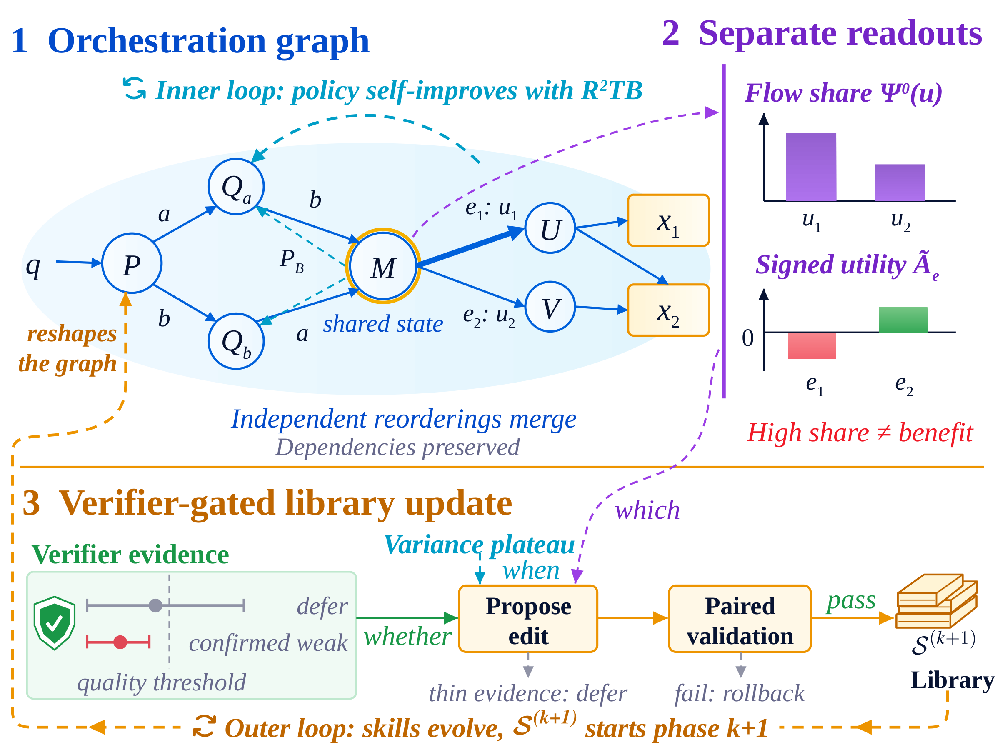
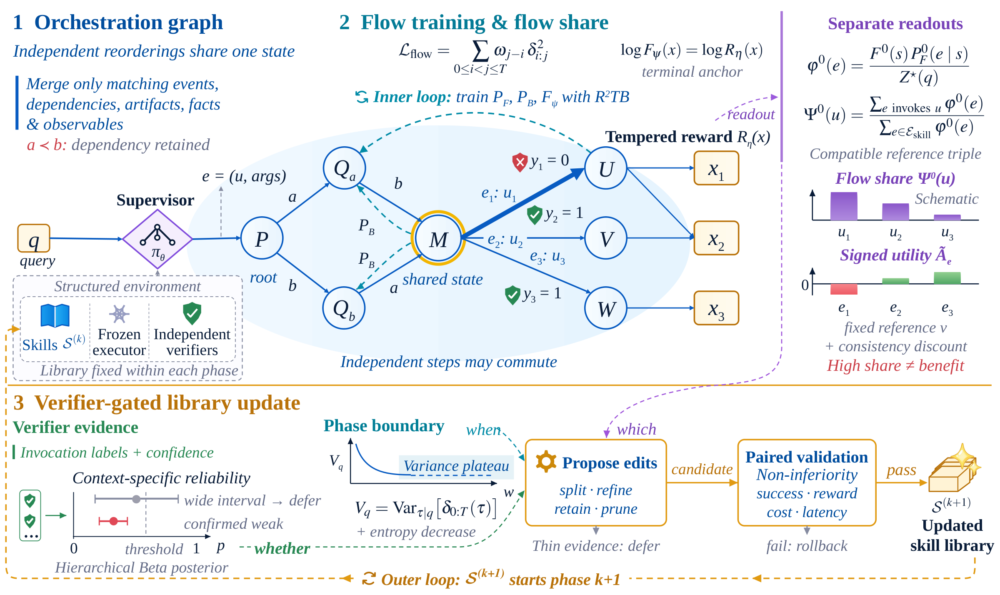

# R² Flow: Recursive Self-Improvement via Recursive Skill Evolution

<div align="center">

[](https://huggingface.co/beita6969/R2Flow-9b)
[](https://huggingface.co/datasets/beita6969/R2Flow-Dataset)

### Train orchestration on shared states, credit skills by flow share, and evolve the library only on verified evidence



</div>

## Overview

R² Flow is a recursive self-improvement framework for LLM agents that orchestrate reusable skills.
Training alternates policy learning, independent verification and versioned skill-library updates:
each phase trains the policy on the library committed by the previous phase, and what the phase
learns decides the next commit. The repository implements the three designs of the paper:

- **Orchestration Graph**: histories that differ only in the order of independent steps are merged
  into one shared state, so that flow training pools evidence across equivalent executions.
- **Flow share**: a flow network is trained on the shared states with the balance objective R²TB.
  Each skill's share of the flow is read out separately from a signed utility that says whether the
  skill helps.
- **Verifier-gated skill-library updates**: independent verifiers decide whether an edit is warranted,
  a plateau of the R²TB residual variance decides when to update, and every edit passes a paired
  validation before it is committed.

## Method

<div align="center">
  
</div>

A **Supervisor** (Qwen3.5-9B with a LoRA adapter) orchestrates each task by emitting one event per
turn: a tool call, a skill call or the final submission. Skills are `SKILL.md` procedures run by a
frozen executor. Within a phase the library is fixed and the Supervisor, a backward policy and a
state flow are trained with R²TB on the orchestration graph (inner loop). At a phase boundary the
flow share and signed utility rank which skills to change, the verifier posterior decides whether an
edit is supported, an external author model writes the edit, and a paired validation admits or
rolls it back; the updated library `S^(k+1)` starts the next phase (outer loop).

## Repository Layout

```text
src/r2flow/experiments/bayesian_training_cli.py   training entry point
src/r2flow/benchmarks/                            task sessions, environments and rewards
src/skillev/policy/                               Supervisor backbone, flow head and event grammar
src/skillev/scoring/                              R²TB objective
src/skillev/rollout/                              episode engine and executor interface
src/skillev/training/                             training loop, phases and trigger
src/skillev/r2flow_evolution/                     readouts, verifier posterior, edit operator, author, gate
src/skillev/verification/                         independent verifiers
configs/r2flow/r2flow_9b_paper.yaml               paper configuration, six domains
configs/r2flow/execution_2gpu.yaml                execution profile
configs/alfworld/base_config.yaml                 ALFWorld configuration
scripts/r2flow/                                   launchers and data builders
data/r2flow/                                      training and test splits
figs/                                             overview and framework figures (Figures 1 and 3)
```

## Requirements

- Python 3.11+
- CUDA GPUs (80 GB class): two for training and one to three for the executor
- [SGLang](https://github.com/sgl-project/sglang) 0.5.15.post1 in a separate environment for the executor
- [EvalPlus](https://github.com/evalplus/evalplus) for MBPP+
- [ALFWorld](https://github.com/alfworld/alfworld) 0.5.0 with its data, and the OpenAI
  [simple-evals](https://github.com/openai/simple-evals) HealthBench source
- An OpenAI Responses-compatible endpoint for the skill author, and one for the HealthBench judge

## Installation

```bash
git clone https://github.com/beita6969/r2flow.git
cd r2flow

pip install -e ".[policy,gpu]"
pip install -e ".[alfworld]"
```

Default locations are set in `scripts/r2flow/env.sh`:

| Item | Variable | Default |
| --- | --- | --- |
| Qwen3.5-9B | `R2FLOW_MODEL` | `models/Qwen3.5-9B` |
| Training data | `R2FLOW_TRAIN_DATA` | `data/r2flow/train` |
| Prepared inputs | `R2FLOW_INPUTS` | `data/inputs` |
| Runs | `R2FLOW_RUNS` | `runs` |
| Executor logs | `R2FLOW_LOGS` | `logs` |

`R2FLOW_TRAIN_PY` and `R2FLOW_SGLANG_PY` point to the interpreters of the training and SGLang environments.

## Dataset

All training and test splits are included in `data/r2flow/` and hosted at
[beita6969/R2Flow-Dataset](https://huggingface.co/datasets/beita6969/R2Flow-Dataset). The paper
evaluates 12 benchmarks: six IID benchmarks for training and testing, and six OOD benchmarks for
generalization only. Each OOD benchmark is posed as one IID task type.

| Benchmark | Role | Training | Test | Test source | Posed as |
| --- | --- | --- | --- | --- | --- |
| HotpotQA | IID | 512 | 128 | distractor *validation* | – |
| TriviaQA | IID | 512 | 128 | rc.nocontext *validation* | – |
| AIME | IID | 512 | 30 | AIME 2026, all problems | – |
| HealthBench | IID | 512 | 128 | 128 of the 5,000 conversations | – |
| MBPP+ | IID | 512 | 128 | 128 of the 378 problems | – |
| ALFWorld | IID | 512 | 128 | *valid_unseen* | – |
| MuSiQue | OOD | – | 128 | MuSiQue-Ans v1.0 *dev* | HotpotQA |
| NQ-Open | OOD | – | 128 | *validation* | TriviaQA |
| MATH-Hard | OOD | – | 128 | MATH *test*, level 5 | AIME |
| GPQA | OOD | – | 128 | Diamond (IDs only) | HealthBench |
| SWE-Bench Verified | OOD | – | 128 | 128 of the 500 instances | MBPP+ |
| WebShop | OOD | – | 128 | official human-goal test range | ALFWorld |

Items are selected by a fixed sha256 ranking of their source IDs, and training items are disjoint
from every test set. GPQA questions are not redistributed: `data/r2flow/test/ood/gpqa_diamond.ids.json`
lists the Record IDs; accept the terms of `Idavidrein/gpqa` and pass `gpqa_diamond.csv` to
`build_ood.py --gpqa-csv`.

The builders `scripts/r2flow/build_ood.py` and `scripts/r2flow/build_data.py` reproduce the splits
from the public source files and are not needed for training.

## Training

One command prepares the initial policy, the deployments document and the bindings on first use,
starts the executor replicas, and launches training:

```bash
export R2FLOW_AUTHOR_API_BASE=<base URL of a Responses-compatible endpoint>
export R2FLOW_AUTHOR_API_KEY_FILE=<absolute path of the file containing the API key>
export R2FLOW_AUTHOR_API_MODEL=<author model name>
export R2FLOW_JUDGE_API_BASE=<base URL of the HealthBench judge endpoint>
export R2FLOW_JUDGE_API_KEY_FILE=<absolute path of the file containing the judge API key>
export R2FLOW_JUDGE_MODEL=<judge model name>
export R2FLOW_SIMPLE_EVALS=<openai/simple-evals checkout>

export R2FLOW_ALFWORLD_PY=<python with alfworld>
export R2FLOW_ALFWORLD_SRC=<git checkout of alfworld>
export ALFWORLD_DATA=<extracted ALFWorld data>
export R2FLOW_EVALPLUS_PY=<python with evalplus>
export R2FLOW_WIKIPEDIA_PASSAGES=<psgs_w100.tsv.gz, DPR Wikipedia passages>

R2FLOW_TRAIN_GPUS=0,1 R2FLOW_EXECUTOR_GPUS=2,3 scripts/r2flow/train.sh
```

| Parameter | Meaning |
| --- | --- |
| `R2FLOW_TRAIN_GPUS` | two GPU indices for the gradient ranks |
| `R2FLOW_EXECUTOR_GPUS` | one to three GPU indices, one executor replica each |
| `R2FLOW_AUTHOR_API_*` | base URL, key file and model of the skill author, called only at phase boundaries |
| `R2FLOW_JUDGE_API_*`, `R2FLOW_JUDGE_MODEL` | HealthBench judge: base URL, key file and model |
| `R2FLOW_SIMPLE_EVALS` | [simple-evals](https://github.com/openai/simple-evals) checkout (HealthBench source) |

Resume a stopped run with `scripts/r2flow/train.sh --run-dir runs/r2flow_<stamp>`.

Important paper-aligned defaults are already set in the configurations:

| Category | Setting |
| --- | --- |
| Supervisor | Qwen3.5-9B, BF16, LoRA rank 4 (alpha 8); frozen executor: the same base model |
| Schedule | 250 steps, one question per domain per step, 4 rollouts each |
| Objective | R²TB, reward temperature 4, ε 0.1, geometric sub-trajectory weight 0.9 |
| Learning rates | adapter 1e-4, flow head 1e-2 |
| Initial library | empty skill slots |
| Phase trigger | held-out residual variance `V_q`, evaluated every 10 steps |
| Validation | paired non-inferiority on success, reward, tokens and latency |

## Model Weights

The trained Supervisor is released as a complete model, with the LoRA adapter merged into
Qwen3.5-9B:

```text
https://huggingface.co/beita6969/R2Flow-9b
```

The merged layers are stored in float32; load the model in float32 to reproduce the trained
Supervisor exactly:

```python
import torch
from transformers import AutoTokenizer, Qwen3_5ForConditionalGeneration

model = Qwen3_5ForConditionalGeneration.from_pretrained("beita6969/R2Flow-9b", dtype=torch.float32)
tokenizer = AutoTokenizer.from_pretrained("beita6969/R2Flow-9b")
```

## License

This repository is released for research use. Please also follow the licenses and terms of the
upstream models, datasets, and benchmark suites used with R² Flow. Third-party material included in
this repository is listed in `THIRD_PARTY_NOTICES.md`.
